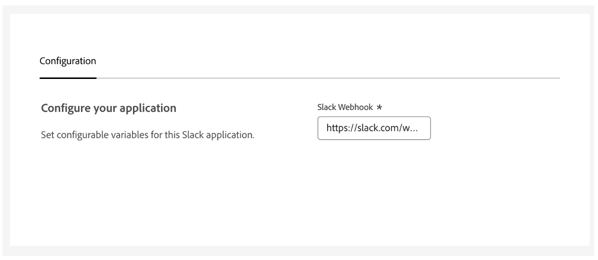
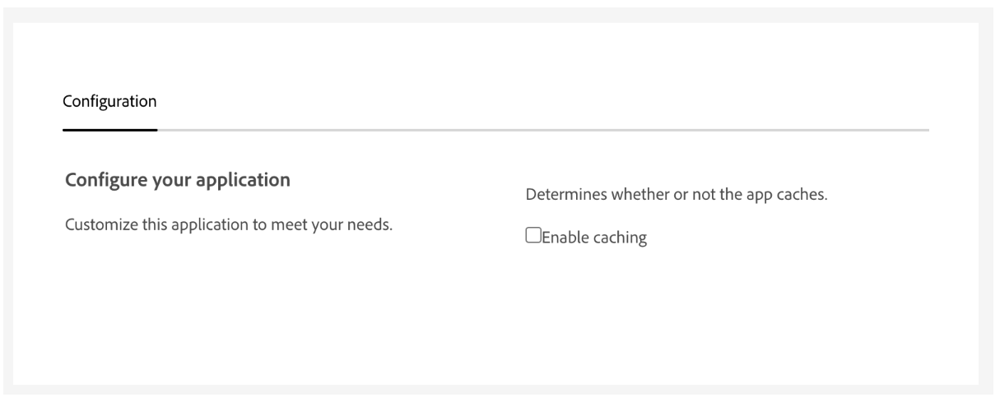
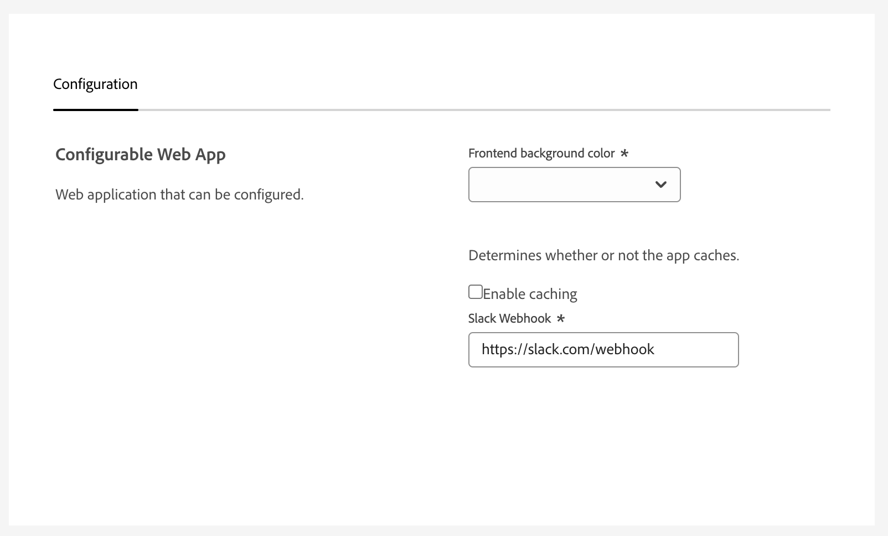

# App Builder ISV Custom Configuration 

MARTIN TO CREATE AN INTRO SENTENCE HERE. 

Developers of distributable App Builder apps can define configuration options for users to set at deploy time.

## Defining custom configuration options

Custom configuration can be defined via the `configSchema` property.

**app.config.yaml**
```yaml
application: 
  <application config>
extensions: 
  <extension configs>
configSchema: # This is a top-level property and is global to the app and all extensions
  title: 'the title'
  description: 'the description'
  properties:
    - title: 'Slack Webhook'
      type: 'string'
      description: 'Please provide the webhook used by this application. Configure in slack.com'
      envKey: 'SLACK_WEBHOOK'
```

## Usage
The `envKey` property of a custom configuration option maps to the environment variable name in the app.

### Runtime action 

To use custom configuration in a Runtime action, map the `envKey` value for the desired variable
to the inputs of the Runtime action, then access values via `params.<envKey>` in the action code. 

#### Example
**app.config.yaml**
```yaml
configSchema:
  title: 'the title'
  description: 'the description'
  properties:
    - title: 'enable caching'
      type: 'boolean'
      envKey: 'IS_CACHING_ENABLED'                      <--- Environment variable name
application:
  actions: actions
  web: web-src
  runtimeManifest:
    packages:
      dx-excshell-1:
        license: Apache-2.0
        actions:
          generic:
            function: actions/generic/index.js
            web: 'yes'
            runtime: nodejs:16
            inputs:
              LOG_LEVEL: debug
              IS_CACHING_ENABLED: $IS_CACHING_ENABLED   <--- Mapped environment variable
            annotations:
              require-adobe-auth: true
              final: true
              code-download: true
```
**Action code**
```js
async function main (params) {
    if (params.IS_CACHING_ENABLED) {
        enableCache()
    }
}

exports.main = main
```

### Web application

To use custom configuration in the web application, values can be accessed directly via `process.env.<envKey>`.

#### Example
**app.config.yaml**
```yaml
configSchema:
  title: 'Configurable Web App'
  description: 'Web application that can be configured.'
  properties:
    - title: 'Frontend background color'
      type: string
      description: 'Please provide the background color for your frontend'
      enum:
        - blue-400
        - celery-400
        - indigo-400
      envKey: FRONTEND_BACKGROUND_COLOR                <--- Environment variable name
application:
  web: web-src
```
**Component.js**
```js
<View backgroundColor={process.env.FRONTEND_BACKGROUND_COLOR}></View>
```

## Custom Configuration Types 

### Text field



```yaml
configSchema:
  title: 'Configure your application'
  description: 'Set configurable variables for this Slack application'
  properties:
    - title: 'Slack Webhook'
      type: 'string'
      description: 'Please provide the webhook used by this application. Configure in slack.com'
      envKey: 'SLACK_WEBHOOK'
      default: 'https://slack.com/webhook' 
```
### Checkbox



```yaml
configSchema:
  title: 'Configure your application'
  description: 'Customize this application to meet your needs.'
  properties:
    - title: 'Enable caching'
      description: 'Determines whether or not the app caches.'
      type: 'boolean'
      envKey: 'IS_CACHING_ENABLED'
```
### Dropdown


```yaml
configSchema:
  title: 'Configurable Web App'
  description: 'Web application that can be configured.'
  properties:
    - title: 'Frontend background color'
      type: string
      description: 'Please provide the background color for your frontend'
      enum:
        - blue-400
        - celery-400
        - indigo-400
      envKey: FRONTEND_BACKGROUND_COLOR
```
### Secret

_Secret screenshot pending bug fix_

```yaml
configSchema:
  title: 'the title'
  description: 'the description'
  properties:
    - title: 'aws secret key'
      type: 'string'
      secret: true 
      envKey: 'AWS_SECRET'
```

### Multiple configuration options 



```yaml
configSchema:
  title: 'Configurable Web App'
  description: 'Web application that can be configured.'
  properties:
    - title: 'Frontend background color'
      type: string
      description: 'Please provide the background color for your frontend'
      enum:
        - blue-400
        - celery-400
        - indigo-400
      envKey: FRONTEND_BACKGROUND_COLOR
    - title: 'Enable caching'
      description: 'Determines whether or not the app caches.'
      type: 'boolean'
      envKey: 'IS_CACHING_ENABLED'
    - title: 'Slack Webhook'
      type: 'string'
      description: 'Please provide the webhook used by this application. Configure in slack.com'
      envKey: 'SLACK_WEBHOOK'
      default: 'https://slack.com/webhook' 
