---
keywords:
  - Listing
  - Marketplace
  - Exchange
  - Distribution
  - Extensibility
  - API
  - Developer Tooling
  - Enterprise Customer
  - Experience Cloud
  - OAuth
  - Server to Server
  - Service to Service
  - Developer Console
  - Admin authentication
  - Software integration
title: Server to Server Integrations
description: Discover and manage server-to-server integration listings on Adobe Exchange
---

# Server-to-server integrations

Server-to-server integrations are partner-built enterprise applications that call Adobe APIs on behalf of a customer's organization to access customer data across Adobe products.

A system administrator of the customer organization must grant consent on behalf of the organization to authorize partner-built applications to access the organization's Adobe data.

You can discover all published server-to-server integration listings on [Adobe Exchange](https://exchange.adobe.com/apps/browse/ec?appType=SPISV&listingType=applications) by applying the **Server-to-server integrations** app type filter.

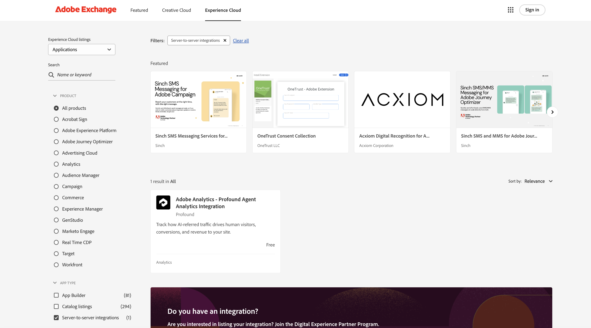

Clicking on the name of an integration listing will take you to that listing's details page, where you can review the integration's description, supported products, media, and help and support options.

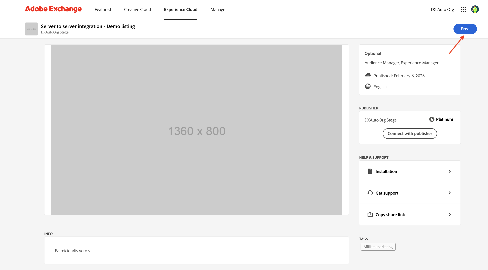

## Acquire integrations

Clicking the **Free** button on the listing details page begins the acquisition process. If the integration has required Adobe products, a confirmation modal titled **This application requires additional product(s)** will appear. Click **Yes, continue** to proceed, or **No, return to browsing** to cancel.

If the developer has provided an end-user license agreement, the **End-User License Agreement** dialog will appear next, with links to the privacy policy and license agreement terms.

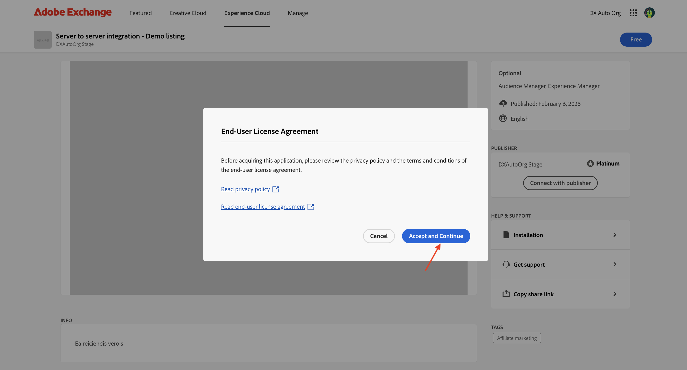

Click **Accept and Continue** to accept the terms. If you are not already signed in, you will be redirected to sign in. Once signed in, the integration will be acquired for the enterprise org associated with your login credentials. The **Free** button is replaced by **Acquired** and a **Begin installation** button.

A confirmation dialog will appear. Its content differs based on your role in the organization.

Non-administrator users will see the **Application was successfully acquired** dialog. It informs them that additional steps must be completed by the system administrator of the organization's Adobe account, and that a notification has been sent to the system administrator.

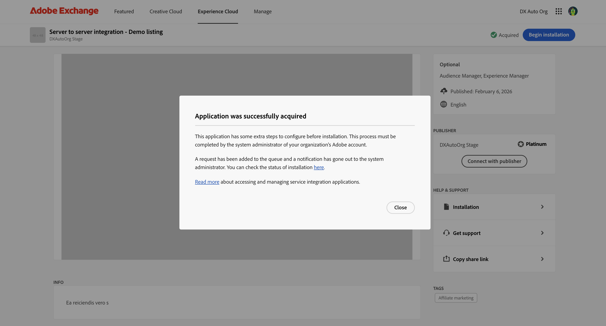

The integration will appear in the **Manage → Integrations** queue with a **Pending access** status until the system administrator completes the installation.

System administrators will see the **Additional installation steps required** dialog after acquiring an integration, or when clicking **Begin installation** on the listing page or from the **Manage → Integrations** queue. The dialog explains that a browser-based workflow is required to approve the connection between the integration and the organization's Adobe account. It also lists any Adobe products supported by the integration.

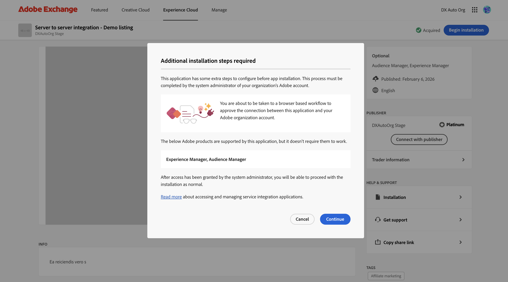

## Consent to allow access

Click **Continue** to be taken to the Adobe IMS consent screen. If prompted to select an organization, choose the same organization you used on Adobe Exchange — selecting a different organization will cause the consent to fail. Review the application name, publisher, and the actions the integration is requesting to perform on your behalf. Click **Allow access** to grant the integration access to your organization's Adobe account, or **Cancel** to go back to Adobe Exchange.

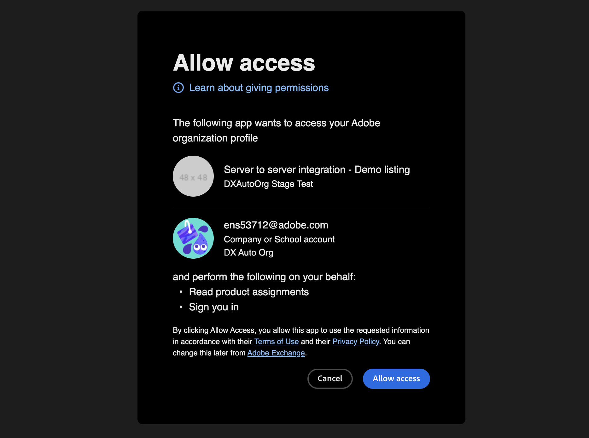

After granting consent, you are redirected to the integration details page in **Manage → Integrations**.

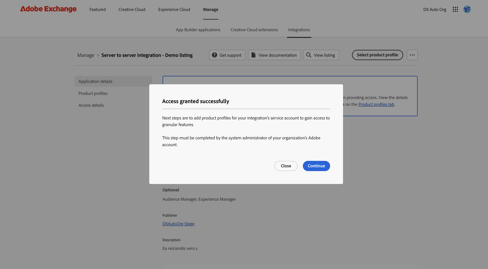

If the integration uses product profiles, the **Access granted successfully** dialog will appear on the integration details page, prompting you to configure product profiles as the next step. Click **Continue** to open the **Select product profiles** dialog to assign product profiles immediately, or click **Close** to skip and configure them later from the **Product profiles** tab. If the integration does not use product profiles, an **Access granted successfully** toast confirmation will appear instead.

## Integration details page

The integration details page has a side navigation with up to three tabs: **Application details**, **Product profiles**, and **Access details**. The **Product profiles** and **Access details** tabs are visible to system administrators only and are only shown when the integration status is **Access granted**.

### Application details tab

The **Application details** tab shows the current status, the user who performed the last consent action, and the date of that action. Below the status information, the **Application details** section lists the integration's supported products, publisher, and description. An activity log records all consent-related actions taken on the integration, including when it was acquired, when access was granted or revoked.

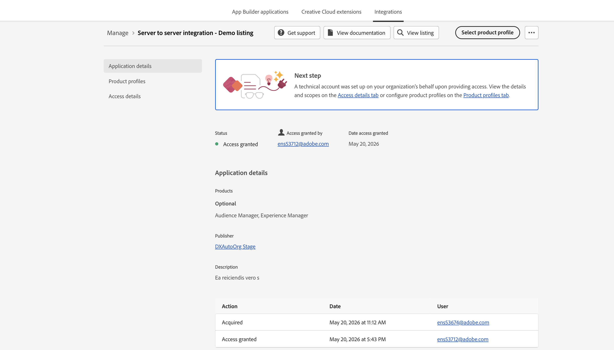

### Product profiles tab

The **Product profiles** tab lists the product profiles currently assigned to the integration's service account, organized by API. The integration's service account gains access to granular features through these product profiles. This tab is shown only if the integration uses product profiles.

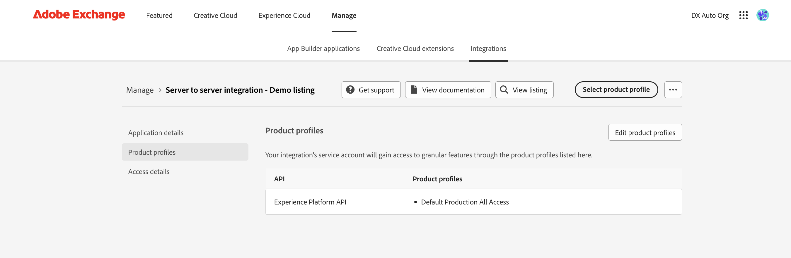

To update product profiles, click **Edit product profiles** on this tab, or click **Select product profile** in the page header. The **Select product profiles** dialog will open.

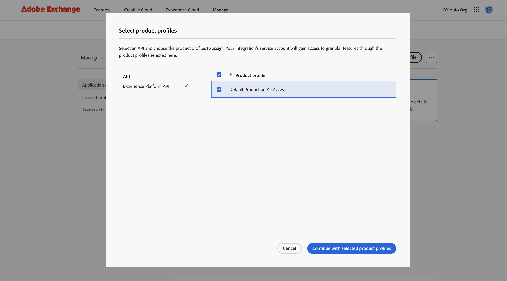

Select an API from the left column and choose the product profiles to assign from the right column. Click **Continue with selected product profiles** to save. A **Product profiles updated successfully** confirmation will appear.

Non-administrators will see a message indicating that viewing or editing product profiles must be completed by the system administrator of their organization's Adobe account.

### Access details tab

The **Access details** tab shows the technical account and scopes that were created when the administrator granted consent.

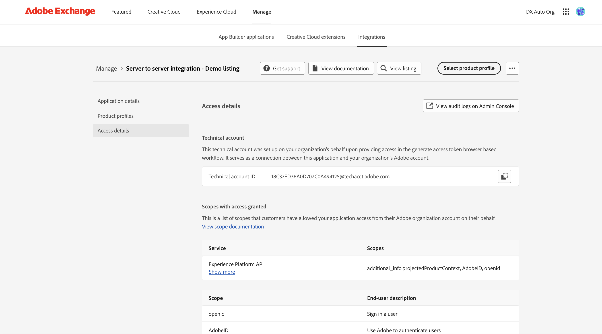

- **Technical account** — the technical account ID created on the organization's behalf during the consent workflow. This account serves as the connection between the integration and the organization's Adobe account.
- **Scopes with access granted** — a list of the Adobe APIs and their associated permission scopes, along with end-user descriptions of each scope.

## Revoking an integration

System administrators can revoke access for an integration by selecting **Revoke access** from the action menu on the integration details page or in the **Integrations** list. This option is displayed in red and is only available for integrations with **Access granted** status.

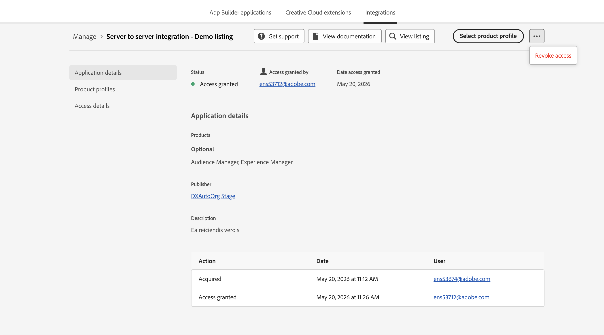

Clicking **Revoke access** opens the **Revoke this application** dialog.

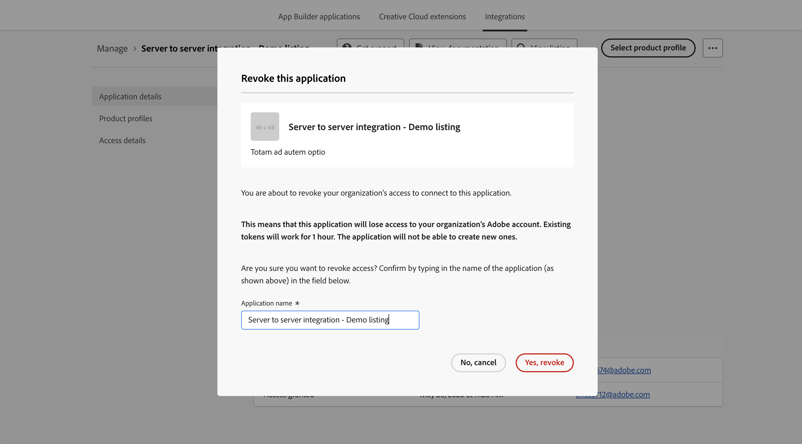

The dialog warns that revoking access will prevent the integration from accessing the organization's Adobe account, and that existing tokens will continue to work for one hour after revocation. To confirm, type the exact name of the application in the **Application name** field, then click **Yes, revoke** (shown in red). Click **No, cancel** to dismiss the dialog without making any changes.

On successful revocation, a confirmation message will appear. The integration's status will change to **Revoked**. The **Product profiles** and **Access details** tabs will be hidden, and the **Begin installation** button will appear in the page header. To restore access, click **Begin installation** to go through the consent workflow again.

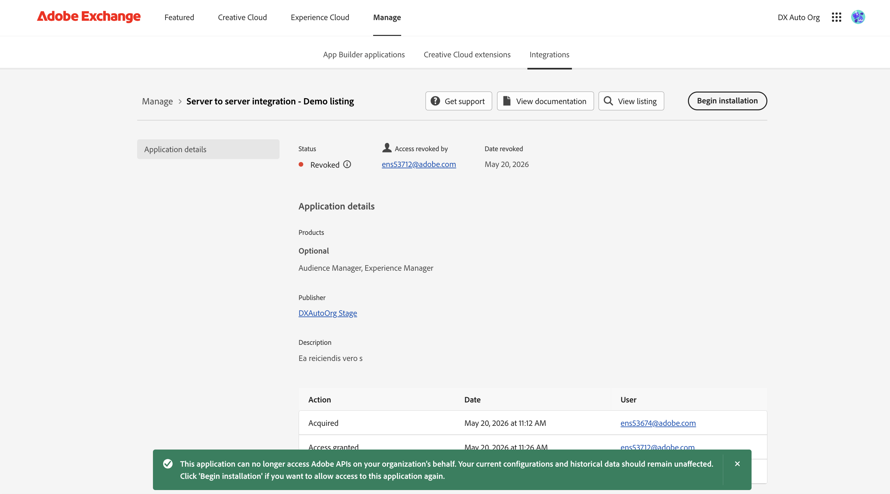

## Getting support

The **Get support** button in the integration details page header opens the **Get support** dialog, which displays the publisher's contact details including their email address, URL, and any other support information they have provided. Click **Connect with publisher** to open the **Contact support team** form.

The form auto-fills your email address and name. Enter your company name in the **Company** field and describe the support needed in the **Message to publisher** field. Check the box to agree to Adobe Terms, then click **Submit** to send the message. A confirmation toast will inform you that the email was sent to the publisher successfully.

## Manage acquired integrations

Navigate to the **Manage** tab from the global navigation bar and select the **Integrations** tab to view all acquired server-to-server integrations within your organization.

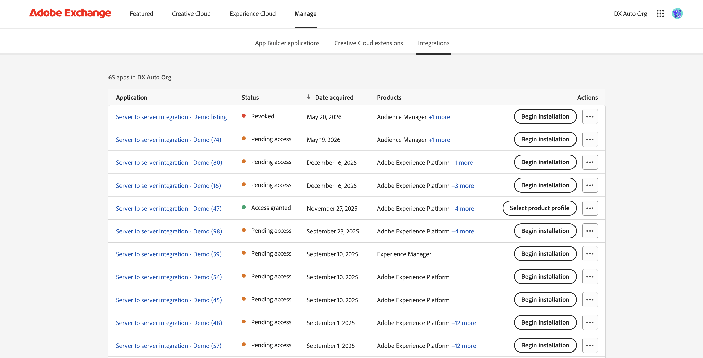

The **Integrations** table includes the following columns:

- **Application** — the name of the integration, linking to its details page
- **Status** — the current consent status:
  - **Access granted** (green) — the administrator has completed the consent workflow
  - **Pending access** (orange) — acquired but consent has not yet been granted
  - **Revoked** (red) — access was previously granted but has been revoked
- **Date acquired** — the date the integration was acquired
- **Products** — the Adobe products the integration supports
- **Actions** — a primary action button and an action menu with additional options. The primary button is **Begin installation** for integrations without **Access granted** status, and **Select product profile** for integrations with **Access granted** status (system administrators only)
