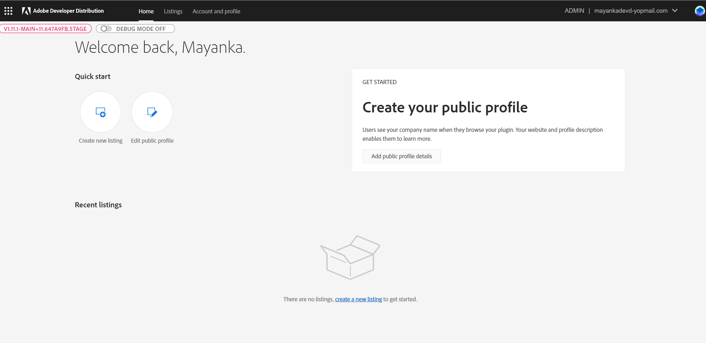
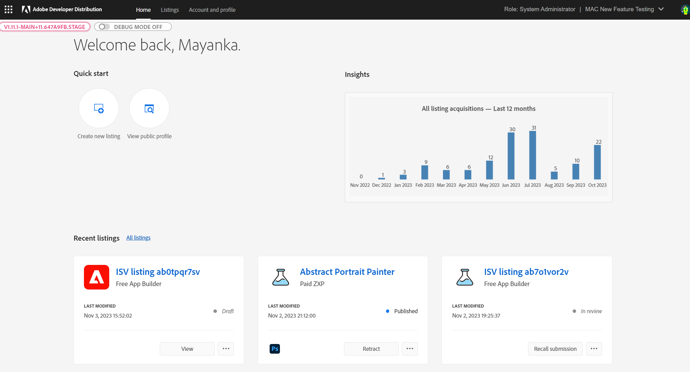
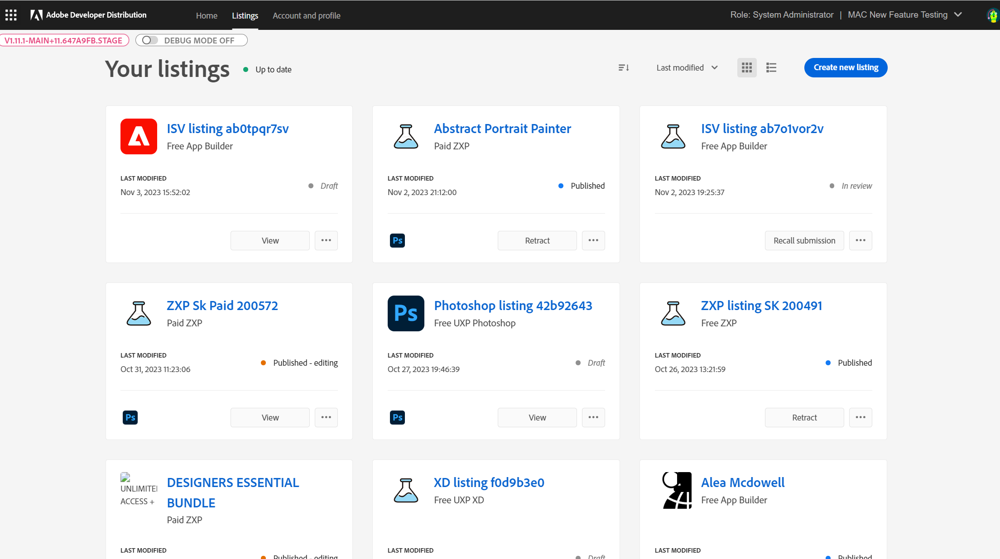
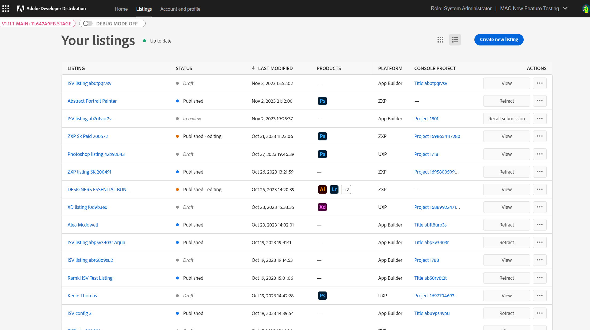
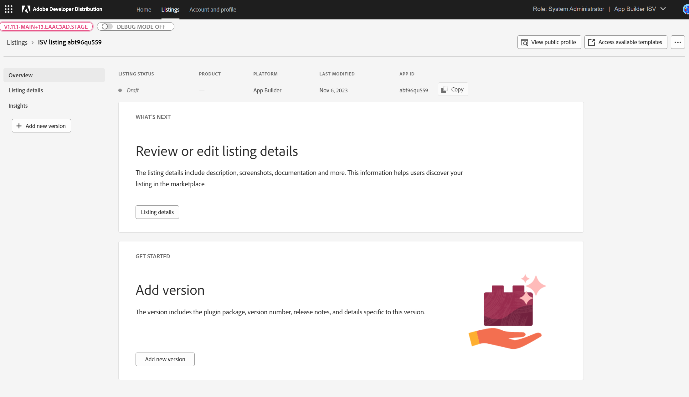
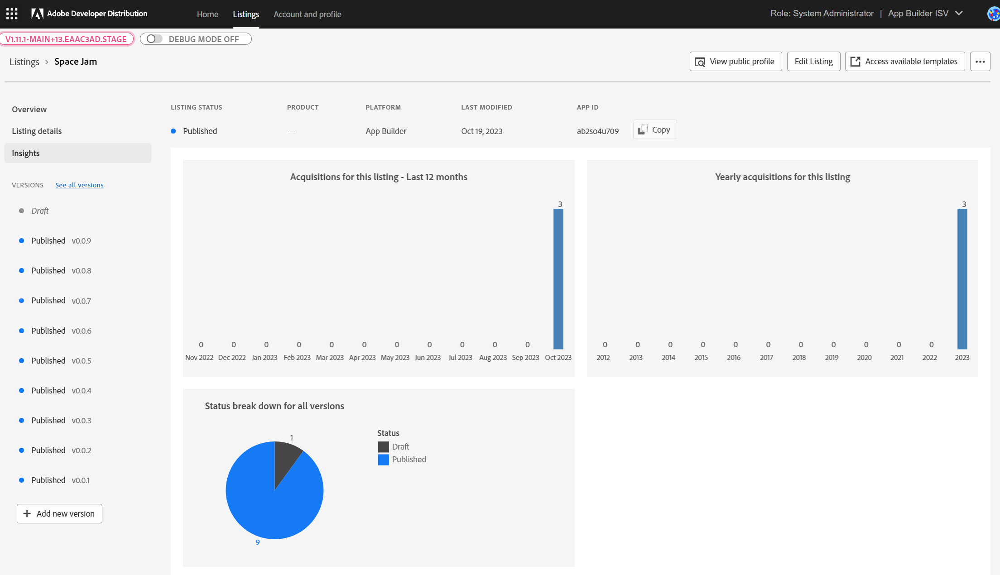

---
keywords:
  - Experience Cloud
  - Marketplace
  - Exchange
  - Distribution
  - Extensibility
  - SDK
  - Developer Tooling
  - UXP
  - Photoshop
  - XD
  - Plugin
  - JavaScript
  - Developer Console
  - Experience Cloud Desktop
  - FastSpring
title: Getting Started
description: This is the getting started page
---

# Getting Started

This getting started guide introduces key areas of the [Adobe Developer Distribution portal](/distribute/home) to help developers begin distributing apps quickly and easily. Adobe Developer Distribution enables self publishing of Software integration or App Builder **listings** to be published on 

1. Add the public profile.
2. Create a **listing** to represent the app with metadata, the packaged app, and a **version**.
3. Submit a **listing** for approval to be published immediately or at a specific future date.

<InlineAlert slots="text" variant="help"/>

A **listing** is what users see on a Marketplace. It contains metadata to describe each app and how to use it, along with a specific **version** of the app to be installed by the Experience Cloud desktop app. For more details on these concepts and how they are used in the distribution of apps, see the [Glossary](./glossary.md).

## Overview

The following section will provide a brief overview of each view in the [Adobe Developer Distribution portal](/distribute/home) to help developers get started using it quickly. This applies to both App Builder and software integration applications.

## Home

The home page is where developers create their public profile and create a new listing for their app. "Quick start" links to create a new listing and edit/view a public profile can be found here. The "Get Started" box reminds developers that a profile must be created and submitted before any app can be submitted for approval.

As listings are created, up to three of the most recent will be shown for quick view and access. As listings are published, an "Insights" summary table will replace the "Get Started" box.

To manage more than three listings, choose the **All listings** link or the **Listings** tab in the nav bar to go to the "Your Listings" page.

## Listings

The developer can manage their listings either in card view or list view. Clicking View on any card leads to the Listing details screens to update the listing details or plugin version. The ellipsis points to more options to manage listing lifecycle, such as publish an approved app or retract a published one. Note that until an app icon is uploaded, a default product mnemonic logo will appear.

CARD VIEW

LIST VIEW

This view allows developers to see more information on their listings.

## Managing a Listing

The developer can click on a listing's name or View button on the home page of “Your listings” page to navigate to a specific listing. Clicking the name of the listing or View button, will land users on the “Listing Overview” page.

The developer can navigate to the “Listing details” page to add listing level metadata details that help users discover their listing in the marketplace once it’s published.

Some of the listing types require a package to be uploaded and validated before the developer can submit the listing for Adobe review. In such cases, the developer will see the option to ‘Add new version’ in the left navigation bar. Clicking on ‘Add new version’ creates a new version and takes the developer to the version details page for the new draft version. The developer can also patch an existing listing by adding a second or subsequent version. In such cases, the version-level metadata from the earlier version is copied over to the new draft version, and the developer can update it as they see fit.

Once the listing is approved, the developer can also edit the listing-level metadata fields (such as its description and support information). The edits to an Approved, Published or Rejected listing also need to go through Adobe review, in order to be approved and merged with the original listing.

## Insights

Insights are available for the listing types that can be acquired from the Adobe Exchange marketplace such as App Builder apps. For such listings, the developer can view the number of plugins acquired by month and year, as well as multiple version status summary for listings that have versions.

The app is now ready to be submitted. For instructions on this, see the App Builder Submission section.
