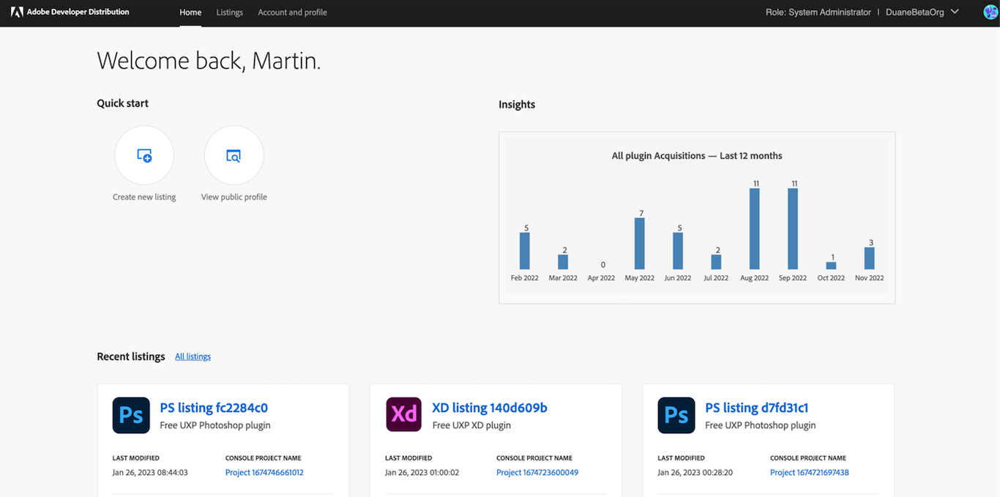

---
keywords:
  - Experience Cloud
  - Marketplace
  - Exchange
  - Distribution
  - Extensibility
  - SDK
  - Developer Tooling
  - UXP
  - Photoshop
  - XD
  - Plugin
  - JavaScript
  - Developer Console
  - Experience Cloud Desktop
  - FastSpring
title: Getting Started
description: This is the getting started page
---

# Getting Started

This getting started guide introduces key areas of the [Adobe Developer Distribution portal](/distribute/home) to help you begin distributing your plugins quickly and easily. The Adobe Developer Distribution portal enables you to quickly publish a **listing** for your plugin on two Experience Cloud Marketplaces; the Experience Cloud desktop app Marketplace and Adobe Exchange in these three easy steps:

1. Add your public profile.
2. Create a **listing** to represent your plugin with metadata, the packaged plugin, and a **version**.
3. Submit your **listing** for approval to be published immediately or at a date you choose.

<InlineAlert slots="text" variant="help"/>

A **listing** is what users see on a Marketplace. It contains metadata to describe your plugin and how to use it, along with a specific **version** of your plugin to be installed by the Experience Cloud desktop app. For more details on these concepts and how they are used in the distribution of your plugin, see the [Glossary](./glossary.md).

## Overview

The following section will provide a brief overview of each view in the [Adobe Developer Distribution portal](/distribute/home) to help you get started using it quickly. This applies to both App Builder and service-to-service applications. 

## Home

The home page is where developers create their public profile and create a new listing for their plugin. Here you will find "Quick start" links to create a new listing and edit or view your public profile. The "Get Started" box helps reminds developers that a profile must be created and submitted before any plugin can be submitted for approval.

As listings are created, up to three of the most recent will be shown for quick view and access. As listings are published, an "Insights" summary table will replace the "Get Started" box. To manage more than three listings, choose the **All listings** link or the **Listings** tab in the nav bar to go to the "Your Listings" page.

## Listings

Manage your listings either in card view or list view. Clicking **View** on any card leads to the Listing details screens to update the listing details or plugin version. The ellipsis points to more options to manage listing lifecycle, such as publish an approved app or retract a published one. Note that until a plugin icon is uploaded, a default product mneumonic logo will appear.

**Card View**

**List View**

## Creating a Listing

Before you can view your listings, you must create a listing for Marketplace. Once you have built, tested, and packaged your app (using App Builder in the Adobe Developer Distribution portal), you can create a listing.

### Overview

**New Listing** - For your first submission, you must submit listing details and a new version together. After publishing, you can submit an update to the listing details or a new version independently from each other. 

### Listing Details

You will submit your app builder new listing metadata in four tabs: General, Media, Categories, and Payment. All mandatory fields are marked with an asterisk. “Add a version” helper text reminds you that a version is also needed the first time a listing is published.

