---
keywords:
  - Creative Cloud
  - Marketplace
  - Exchange
  - Distribution
  - Extensibility
  - SDK
  - Developer Tooling
  - UXP
  - Photoshop
  - XD
  - Plugin
  - JavaScript
  - Developer Console
  - Creative Cloud Desktop
  - FastSpring
title: Getting Started
description: This is the getting started page
---

# App Builder ISV

This getting started guide introduces key areas of the [Adobe Developer Distribution portal](/distribute/home) to help you begin distributing your plugins quickly and easily. The Adobe Developer Distribution portal enables you to quickly publish a **listing** for your plugin on two Creative Cloud Marketplaces; the Creative Cloud desktop app Marketplace and Adobe Exchange in these three easy steps:

## Creating a Listing 

A new listing can be created from the home page or the “Your listings” page. Clicking on ‘Create a new listing’ lands the developer on the modal overlay where they must choose the type of listing they want to create.  

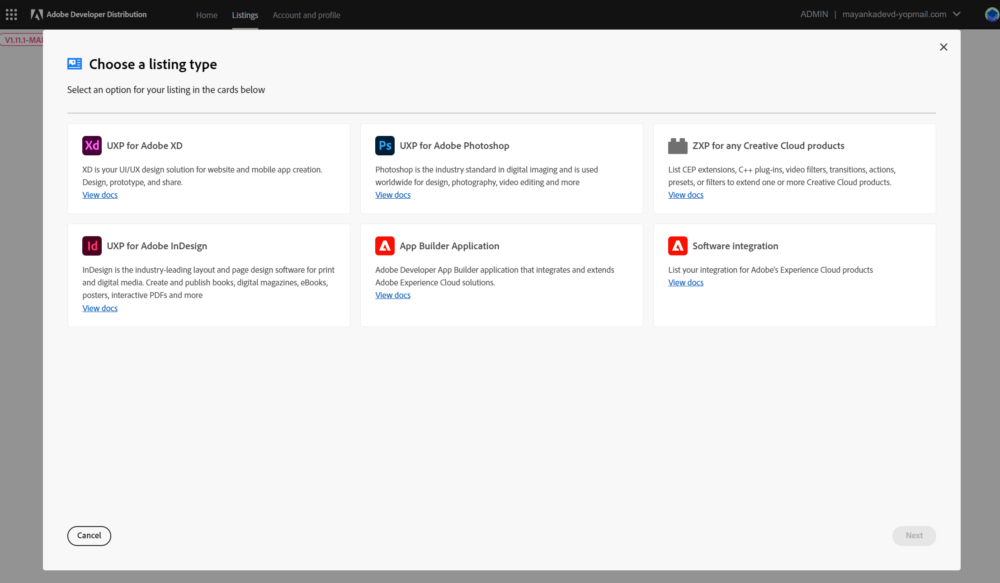

Some types of listings have prerequisites that developers need to fulfil before they can create the listing. For example, in order to create an App Builder application or a software integration listing, a developer either needs to belong to an Enterprise organization because they have purchased Experience Cloud products or they will need   to first register to the Technology Partner Program portal.  

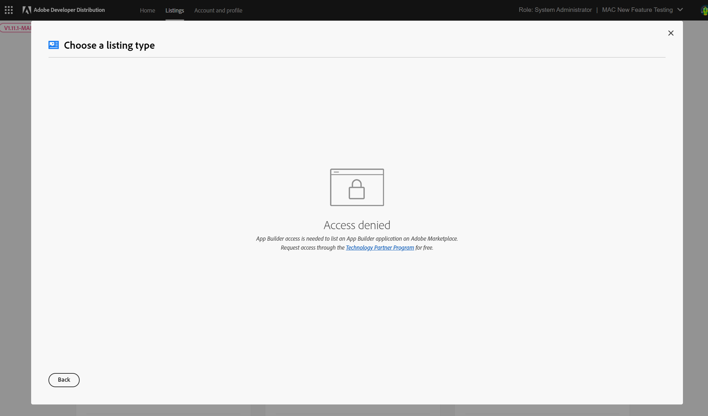

Once the listing type has been chosen, another modal will ask the developer to choose the project they want to be associated with the listing. The developer can either choose an existing project, or create the listing in a new project. 

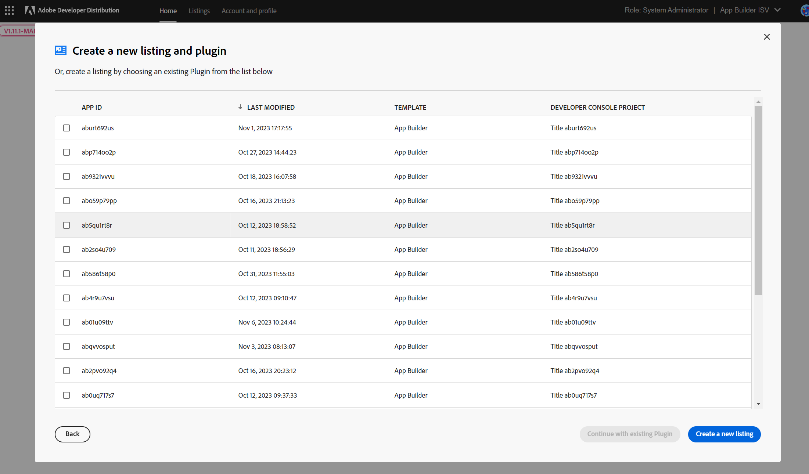
 
Upon successful creation of the listing, the developer will be routed to the "Listing Overview" page. This page provides a high-level overview of the listing, such as its status, listing type, last modified date, and next steps. 

The developer can navigate to the “Listing details” page to add listing-level metadata details that help users discover their listing in the marketplace once it’s published.  

This is the landing page to create a submission. Note the following items for App Builder listings: 

1.	The navigation panel on the left confirms that this is the Listing Details screen. 
2.	The requestor's role and organization name are listed in the upper right-hand corner. If any profile details need to be edited, click the "Edit Public Profile" tab. 
3.	The menu at the top of the screen indicates the listing status, the platform, the last modified date, and the APP ID. 
The listing details for the app are ready to be added now.  

## Listing Details 

Submit the App Builder new listing metadata in multiple tabs: General, Media, Categories, and Payment. All mandatory fields are marked with an asterisk.  
 
Listing details and a new version must be submitted together for the first listing. After publishing, the developer can submit an update to the listing details or a new version independently from each other. 

New Submission - Once the app has been built, tested, and packaged (using App Builder in the Adobe Developer Distribution portal), create the listing for the Marketplace. Executing the command "Distribute" will take you the Developer Console to create a listing for the app. 
 
The General tab has the application’s public name, a short description (subtitle), a long description, URL for documentation, support information (email and URL), URL for Privacy policy, and URL for Terms of Service. Be sure to save a draft if you navigate away from the page. 

The Media tab requires three different icon sizes for each integration. To describe the integration, up to ten screenshots and up to ten video links can be used. A caption can be added for each image and video. 

The Categories tab has categories (such as Country and Industry) and custom tags that developers can add. These categories and tags help marketplace customers discover and filter/sort App Builder apps published on the marketplace.  

The “Marketplaces” checkbox lets the developers choose if they want to publish their application on the Commerce marketplace, along-with the Exchange marketplace. When choosing to publish on Commerce marketplace, additional categories need to be completed. 

The Payment tab is for entering purchase options to the listing. For now, the only option that App Builder listings can offer is 'Free' as the purchase method. In the future, App Builder listings will also have the paid purchase methods of subscription and one-time payment (Perpetual). 

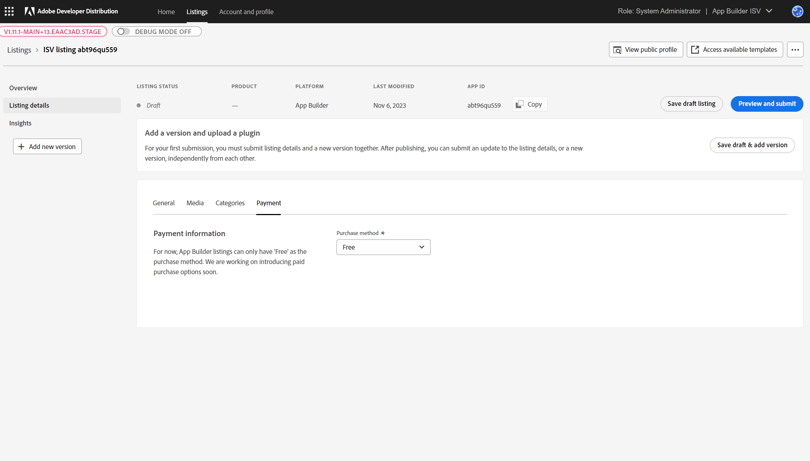

## Version Details 

App Builder requires a package to be uploaded and validated before the developer can submit the listing for Adobe’s review. The developer will see the option to ‘Add new version’ in the left navigation bar. Clicking on ‘Add new version’ creates a new version and takes the developer to the “Version Details” page.  

Once the app has been built, tested, and packaged (using App Builder in the Adobe Developer Distribution portal), the package can be uploaded by dragging and dropping the package on the “Version Details” tag or by clicking “Select a file”. Upon successful upload of a file, scans and validations are performed to confirm that all the details of the package are in the required format, and the files are the right size and type.  

The developer can keep adding more information related to the version (such as optional products that their app supports and release notes) while the validations are performed. The “Package download” checkbox lets developers opt to allow users to download the package once they have acquired it from the marketplace.  

When all the mandatory listing and version level details have been added, and the version package has passed the validations, the Preview and submit button will be enabled. Clicking the button will open the submission modal. The modal also gives the developer the option to preview the listing or view their public profile.  

For an initial listing, the developer can’t choose what they are submitting as a new listing and its first version are always submitted together. The developer must provide a note to Adobe reviewers and mark the checkbox for Adobe brand guidelines in order for the Submit listing button to be enabled.  

“Delay publishing” allows the developer to choose whether they want to publish the app immediately on approval by Adobe, or at a later date.  

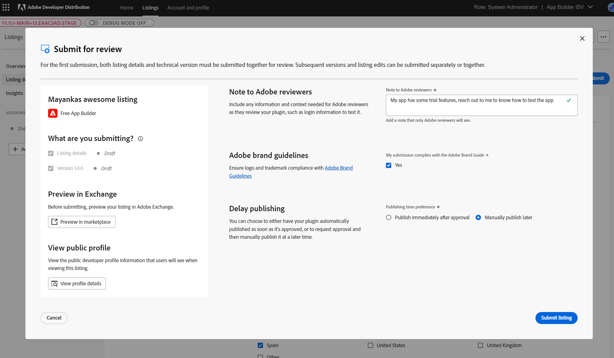

Upon successful submission of the listing, the developer is taken to the “Listing Overview” page, where a success message confirms the submission. The status of the Listing changes from draft to “In review." 

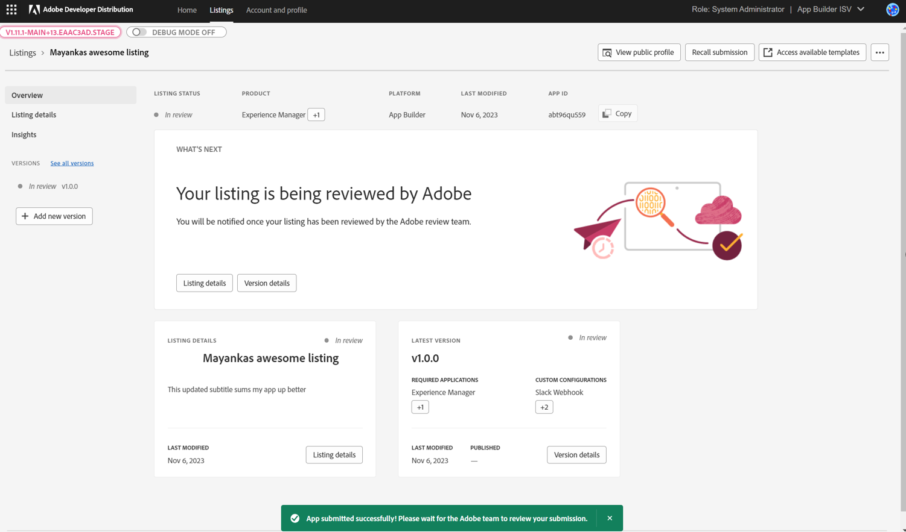

## Reviewing A Submission 

When an application has been submitted for review, an Adobe administrator will review the application details. If all the information is complete and the requirements are met, the reviewer will approve the submission. The status of the submission will show a green ‘Approved’ or ‘Published’, depending on what the developer chose as the publishing time preference.  

The developer is notified by email when the listing is submitted, and when it has been approved and published on the marketplace. 

An existing listing can be patched by adding a second or subsequent version. In such cases, the version-level metadata from the earlier version is copied over to the new draft version for the developer to update as they see fit. 

Listing details can be edited on a published listing. Metadata edits are highlighted by a yellow outline. The status has an edit suffix.  

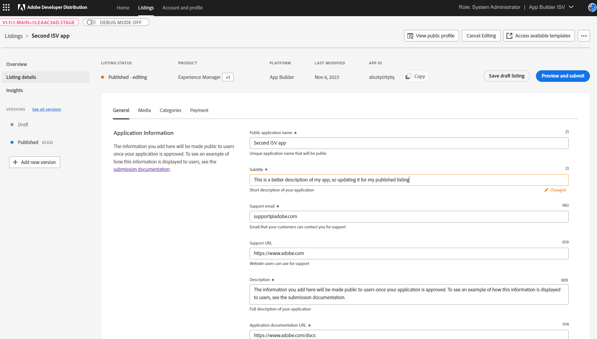

Edits can be submitted for review and will take effect immediately upon approval. Note the edit suffix on the submission modal and the fact that “Delayed publishing” is disabled for metadata changes to a published listing. 

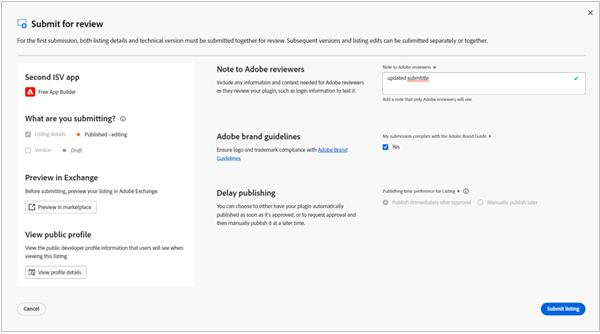

## App discovery and acquisition on Exchange marketplace (Manage screen) 

Published App Builder apps start showing up on the Exchange marketplace in the Experience Cloud browse page. The App Builder app can be discovered by using keyword search and filters, such as Adobe products, the app extension, industry, and country. Users can also filter apps by partnership level of the app publishers. 

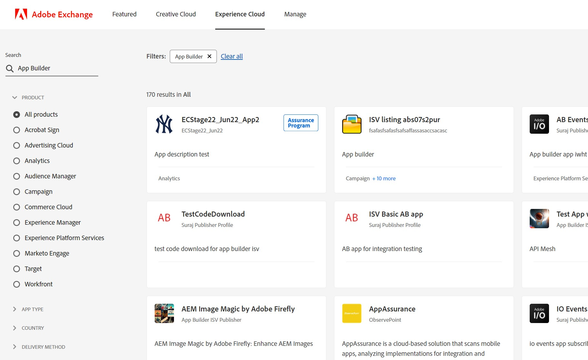

Clicking on the name of an app listing will take the marketplace user to that app listing’s details page. The listing details page will show ‘App Builder’ as one of the Required products.

If, after viewing the application details, the user decides to acquire the app, they can click the ‘Free’ button on the top right. This will open a window informing them about which Adobe products their organization should have in order for the app to function as intended.   

Clicking ‘Yes, continue’ will display the link for the end-user license agreement provided by the developer of the app. 

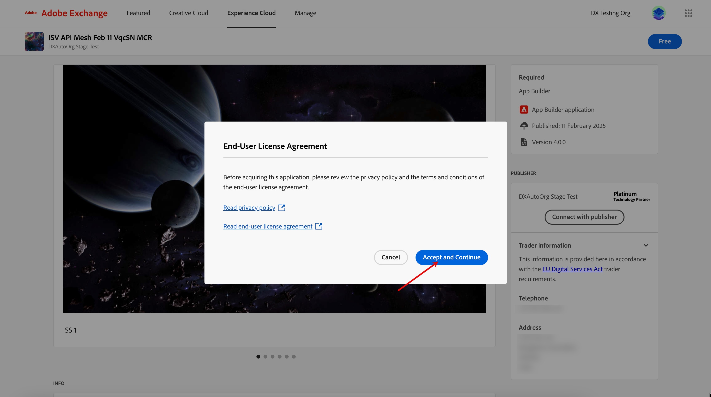

If the user clicks on the ‘Accept and continue’ button on the End-user license agreement, they will be taken to the sign-up-sign-in screen and required to login to the Exchange marketplace (if they aren’t already logged in). Once they log in, the app will be acquired for the org that they are logged in to. The ‘Free’ button will be replaced by ‘Manage’, and the app will start showing as ‘Acquired’. Users will also see a confirmation informing them that the app has been acquired, and the system administrator of their org needs to approve the acquisition before it can be installed and used. 

Clicking ‘Manage’ on the app listing details page, or the ‘Manage your app’ button will route the user to the tab Experience Cloud Applications tab on the ‘Manage’ page, where the application details page for that app will appear.  

The user can also navigate to the Manage tab from the global navigation bar on the Exchange marketplace and click on the ‘Experience Cloud Applications’ tab to view all apps acquired for their org. Admins will also see the option to ‘Review’ for apps that have been acquired, but not approved yet. 

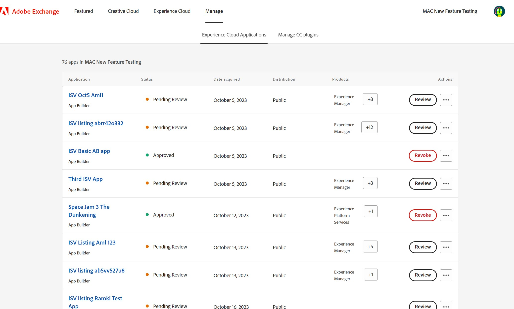

Clicking on an app’s name on the Experience Cloud Applications tab will take the user to the application details page for that app, where the user will see the options to ‘Get support’ from the developer, ‘View documentation’ for the app, and ‘View listing’ on the Exchange marketplace. The system administrator will also see the option to ‘Review’ the app for their org.  

Clicking on ‘Review’ will open the modal ‘Review this application’ with the app’s name and description. The system administrator will need to add notes to approve or reject the app for use. 

If the system administrator rejects the app, the user will see the option to request for approval again on the application’s details page. 

Clicking on ‘Request again’ will change the status of the app to ‘Pending review’. A request will then be sent to the system administrators of the organization to review the app. The user will be routed back to the Experience Cloud Applications tab with a success toast informing them that their request for review was sent successfully. 

NEED SCREENSHOT OF THIS. 

If the administrator approved the app, the status of the app will change to ‘Approved’. The administrators of the organization will start seeing the option to ‘Revoke’ the app on the application’s details page.  

For the users in the organization to start using the application, the administrator will need to add and install environments that they need. Clicking ‘Add environment’, the administrator will see the modal to name a new environment and save it. 

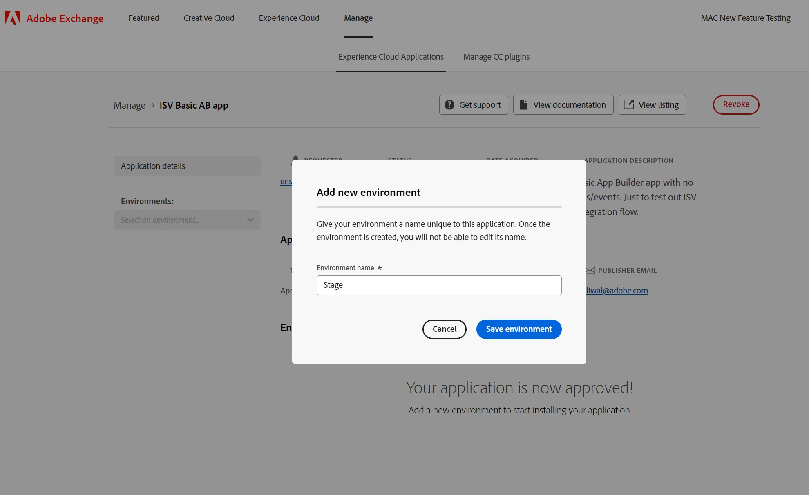

Upon creation of a new environment, the administrator will see a success toast on the application details page, and a message that the environments have been created for the application. 

Clicking on the card of an environment will route the administrator to the details page for that environment. On the ‘Configuration’ tab, they will see the option to choose the custom configurations and product profiles for the environment before deploying the application. These custom configurations are provided by the developer of the applications while uploading the application’s package on Developer Distribution. So, they will vary from application to application, depending on the configurations that the developer needs for their application to function optimally. 

After choosing the configurations and product profiles, the administrator will be able to deploy the application. Upon clicking ‘Deploy’, a toast will let them know that deployment is underway and might take a few minutes. 

