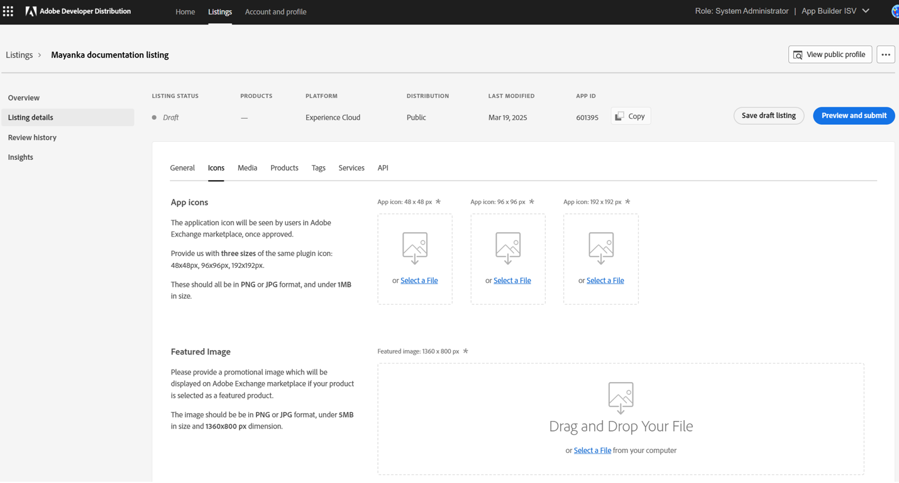
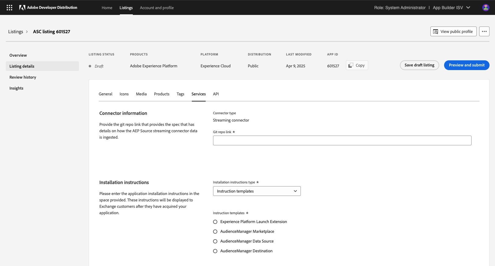

---
keywords:
  - Listing
  - Marketplace
  - Exchange
  - Distribution
  - Extensibility
  - API
  - Developer Tooling
  - Enterprise Customer
  - Photoshop
  - AEP
  - Plugin
  - JavaScript
  - Developer Console
  - Experience Cloud
  - FastSpring
title: S2S Integrations
description: Server to server integration listing submission
---

# Server-to-server integrations

This guide provides developers with step-by-step instructions or creation and submission of a Server-to-server integration listing on [Adobe Developer Distribution](https://developer.adobe.com/distribute), for Adobe review.

<InlineAlert slots="text"/>

Adobe has introduced a new enterprise credential that will enable developers to publish Server-to-server integrations which users can acquire from [Adobe Exchange](https://exchange.adobe.com/) without having to contact the developer directly. Existing metadata-only Server-to-server integrations that cannot be acquired from the [Adobe Exchange marketplace](https://exchange.adobe.com/) are referred to as 'catalog listings' whereas 'Server-to-server' integration listings refer to integrations created with the new enterprise credentials. The process for creating these listings will differ. This guide focuses on instructions to create listings for integrations that use the new enterprise credentials.

## Creating a Listing

A new listing can be created from the home page or the “Your listings” page. Clicking on ‘Create a new listing’ lands the developer on the modal overlay where they must choose the type of listing they want to create.

There are two types of ‘Server-to-server integration for Experience Cloud’ listings that developer can create on [Adobe Developer Distribution](https://developer.adobe.com/distribute). One is specific to an Adobe Experience Platform (AEP) Sources streaming connector use case and the other use case is of a generic server-to-server integration for all other use cases such as for Adobe Analytics or Adobe Campaign. Note that:

* Sources connectors are also discoverable in Adobe Experience Platform (AEP)’s Sources catalog, and hence the developer needs to choose the Adobe Experience Platform (AEP) Sources specific listing card, called ‘AEP Sources streaming connectors’, if building an Adobe Experience Platform (AEP) Sources streaming connector.
* For all other integrations, the developer needs to choose card ‘Server-to-server integration’

In order to create a server-to-server integration listing for Adobe’s Digital Experience products, the developer must have a sandbox Enterprise org associated with their Adobe login. All Technology Partner Program members get a sandbox enterprise org assigned upon approved registration. Attempting to create an integration listing without joining Technology Partner Program will result in the access denied screens as below. If you encounter this screen, file a [TPPSupport ticket](https://partners.adobe.com/ec/cform/case) to get help resolving the screen.:

Once the listing type has been chosen, another modal will ask the developer to choose the [Adobe Developer Console](https://developer.adobe.com/console) project they want to be associated with the listing. Note that to create a server-to-server integration listing of either of the two types (Adobe Experience Platform Sources connector or generic), The developer must choose an existing project that was created in [Adobe Developer Console](https://developer.adobe.com/console). Only the projects that have the required enterprise credential added to them will show up on this screen. If no project exists with an enterprise credential, the developer will need to first go to [Adobe Developer Console](https://developer.adobe.com/console) and create it.

Upon successful creation of the listing, the developer will be routed to the "Listing Overview" page. This page provides a high-level overview of the listing, such as its status, products it integrates with, listing type, distribution type (private/public), last modified date, app ID, and next steps.

The developer can navigate to the “Listing details” page to add listing-level metadata details that help users discover their listing in the marketplace once it’s published.

This is the landing page to create a submission. Note the following items:

  1. The navigation panel on the left confirms that this is the Listing Details screen.
  2. The requestor's role and organization name are listed in the upper right-hand corner.
  3. The menu at the top of the screen indicates the listing status, products it integrates with, listing type, distribution type (private/public), last modified date and app ID.

The listing details for the app are ready to be added now.

## Listing Details

The developer can submit the new listing metadata in multiple tabs: General, Icons, Media, Products, Tags, and Services. Another tab called ‘API’ allows developer to see details on the associated [Adobe Developer Console](https://developer.adobe.com/console) project, connected credential, connected APIs and their respective scopes. All mandatory fields are marked with an asterisk.

The General tab has the application’s public name, a short description (subtitle), a long description, support information (email, URL, phone number and information), and consent screen details that the customer will be able to see before giving their consent to the developer’s application before using it, once it’s published. Be sure to save a draft if you navigate away from the page.

The Icons tab requires three different icon sizes for each integration. Featured image is also required for the published apps that are chosen to be featured on the Exchange marketplace.

The Media tab has screenshots, videos, documents, and developer references. Up to ten screenshots and up to ten video links can be added and a caption can be added for each screenshot and each video. Up to ten documents and up to ten developer reference materials can be added as URLs.

The Products tab has the list of Adobe products that the server-to-server integration might support. The developer can choose one or more products as ‘Required’ or ‘Optional’. Required products are the ones that the integration needs to function properly. Optional products are the ones that the integration supports but doesn't necessarily require. At least one Required or two Optional products need to be added.

Note that for Adobe Experience Platform Sources connectors listing, ‘Adobe Experience Cloud’ is pre-selected. However, the developer can add, edit or remove products on this tab based on which product/s their integration works with. The developer should be careful in choosing the products to match the services (Adobe APIs) that they have added to the project in [Adobe Developer Console](https://developer.adobe.com/console), otherwise Adobe reviewer might reject the listing.

The Tags tab has standard tags, categories (such as Country and Industry), and custom tags that developers can add. These categories and tags help marketplace customers discover and filter/sort the server-to-server integration listings published on the marketplace.

The Services tab is for entering information such as installation instructions and supported languages. The developer can choose an existing template for installation instructions or add a custom one in the URL format. Supported languages are the languages that the application’s in-app UI supports.

Note that for  Adobe Experience Platform (AEP) Sources connectors, developer is also required to share the git repo link that provides the spec that has details on the connector metadata and on how the AEP Source streaming connector data is ingested.

The API tab has the details added from the associated [Adobe Developer Console](https://developer.adobe.com/console) project. The API tab shows the project name, credential name and redirection details, client ID, connected services (APIs added in corresponding [Adobe Developer Console](https://developer.adobe.com/console) project), service-wise list of associated scopes and their scope descriptions that the customer admins will be able to see while providing their consent to the integration. The information on this tab is read-only on [Adobe Developer Distribution](https://developer.adobe.com/distribute) and can only be edited in [Adobe Developer Console](https://developer.adobe.com/console). The purpose of this information showing on [Adobe Developer Distribution](https://developer.adobe.com/distribute) is to help developer ensure that everything is correct, before submitting the integration listing for Adobe’s review.

When all the mandatory metadata details have been added, clicking the ‘Preview and submit’ button will open the confirmation modal. This modal informs the developer that they cannot add or remove APIs once the listing is submitted for Adobe’s review. Additionally, on submission, the credential name on [Adobe Developer Console](https://developer.adobe.com/console) is updated to the listing name that the developer has provided on [Adobe Developer Distribution](https://developer.adobe.com/distribute). Lastly, they are also informed that a redirection link will be added to their listing, so that the customer organization’s admin initiating consent to the application from the Exchange marketplace will be redirected back correctly, after providing the consent.

Clicking the ‘Yes, continue’ button will open the submission modal. The modal also gives the developer the option to preview the listing or view their public profile.
The developer must provide a note to Adobe reviewers and mark the checkbox for Adobe brand guidelines for the Submit listing button to be enabled.
Delay publishing allows the developer to choose whether they want to publish the initial listing immediately on approval by Adobe, or on a later date. Note that for AEP Sources connector listings, the listings will be published on the Exchange marketplace and AEP Sources connectors catalog in AEP on the same date. To ensure this, AEP Sources connector listings are published immediately on approval, and can’t be manually published later by the developer.

Upon successful submission of the listing, the developer is taken to the ‘Listing Overview’ page, where a success message confirms the submission. The status of the Listing changes from draft to ‘In review’, and the developer receives an email communication confirming the same.
Till the time an Adobe reviewer is assigned to review the listing, the developer can recall it from the review queue by clicking on Recall submission button.

## Reviewing a Submission

When an integration has been submitted for review, an Adobe administrator will review the application details. If all the information is complete and the requirements are met, the reviewer will approve the submission. The status of the submission will show a green ‘Approved’ or ‘Published’, depending on what the developer chose as the publishing time preference.
The developer is notified by email when the listing is approved and published on the marketplace.

Listing details can be edited on an approved, published, or retracted listing. Metadata edits are highlighted by a yellow outline. The status has an edit suffix.

Edits can be submitted for review and will take effect immediately upon approval. Note the edit suffix on the submission modal and the fact that 'Delayed publishing’ is disabled for metadata changes to an approved, published or retracted listing.

If you have any questions or suggestions regarding this guide, please file a help ticket to [TPP Support](https://partners.adobe.com/ec/cform/case).
