---
keywords:
  - Listing
  - Marketplace
  - Exchange
  - Distribution
  - Extensibility
  - API
  - Developer Tooling
  - Enterprise Customer
  - AEP
  - Solution
  - JavaScript
  - Developer Console
  - Experience Cloud
  - Partner Solutions
  - Digital Experience Program
title: Solution for Experience Cloud
description: Solution listing submission for Experience Cloud
---

# Solution for Experience Cloud

This guide provides partners with step-by-step instructions for creating and submitting a Solution listing for review on [Adobe Developer Distribution](https://developer.adobe.com/distribute).

Solutions are partner-built offerings that address specific industry needs or business use cases using Adobe Experience Cloud products. They can only be submitted by members of Adobe's [Digital Experience Partner Program](https://partners.adobe.com/digitalexperience/). Once approved, solutions are discoverable on the [Adobe Exchange Marketplace](https://exchange.adobe.com/) and [Adobe Partner Directory](https://partners.adobe.com/s/directory/solution).

## Creating a Listing

A new listing can be created from the home page or the "Your listings" page. Clicking on 'Create a new listing' lands the partner on the modal overlay where they must choose the type of listing they want to create. Select the **Solution for Experience Cloud** card to proceed.

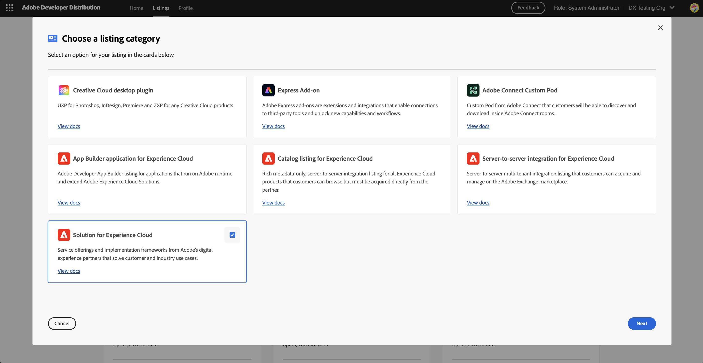

In order to create a Solution listing, the partner must be logged into an organization enrolled in the [Digital Experience Partner Program](https://partners.adobe.com/digitalexperience/). Attempting to create a listing without the required program membership will result in the access denied screen shown below. If you encounter this screen, make sure you are logged in with the correct organization. If the issue persists, contact [Partner Support](https://partners.adobe.com/digitalexperience/m/forms/case) for more details.

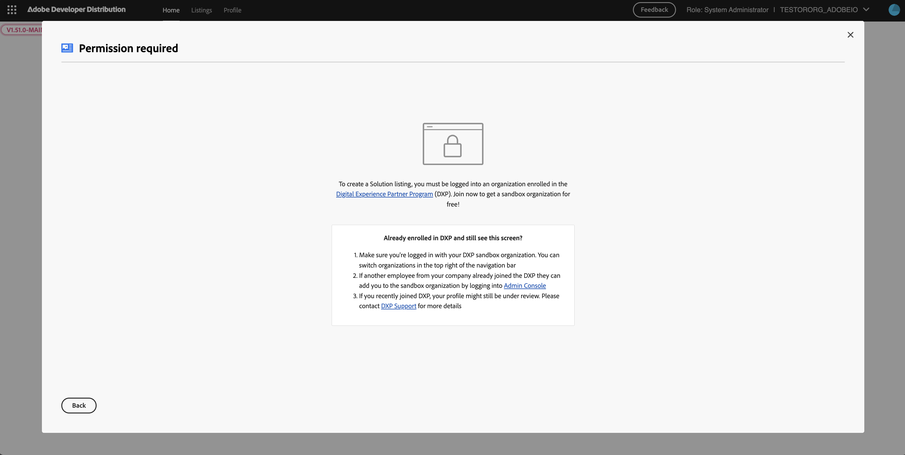

Upon successful creation of the listing, the partner will be routed to the "Listing Overview" page. This page provides a high-level overview of the listing, such as its status, platform, distribution type, last modified date, and solution ID.

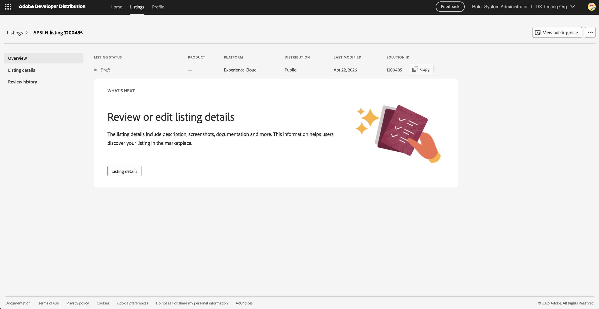

The partner can navigate to the "Listing details" page to add listing-level metadata that helps users discover and evaluate the solution once it is published.

## Listing Details

The listing details are organized into multiple tabs: **General**, **Icons**, **Media**, **Partner (Adobe internal)**, **Overview (Adobe internal)**, **Resources (Adobe internal)**, **Resources**, **Products**, and **Tags**. Tabs marked with "Adobe internal" contain fields that are only visible to Adobe employees and reviewers — they do not appear on the public listing.

### General

The General tab includes the solution's public-facing details. The name and short description appear on Exchange listing cards, while the full description is displayed on the solution details page. An optional website URL can also be provided.

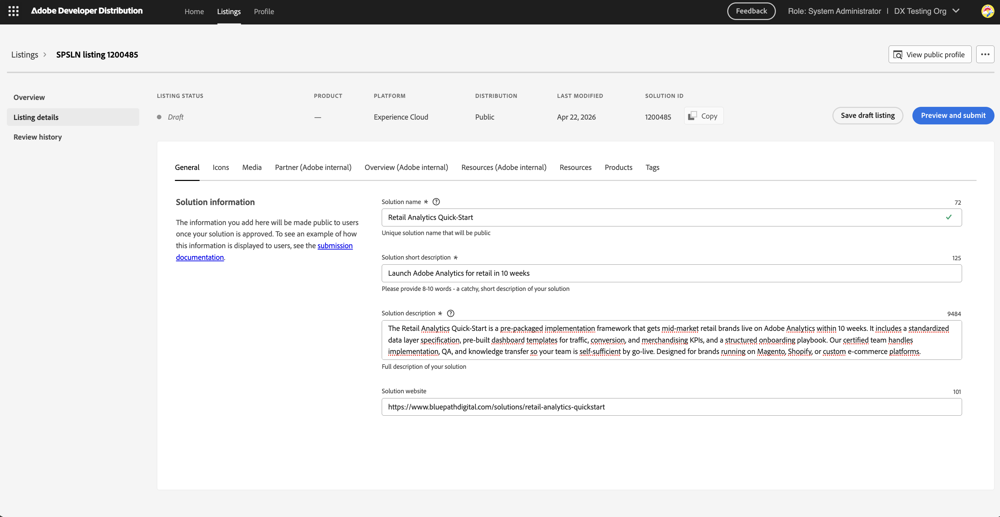

### Icons

The Icons tab requires uploading solution icons in three sizes: 48×48 px, 96×96 px, and 192×192 px.

A featured image can optionally be provided. It will be displayed in the Exchange Marketplace featured carousel if the solution is marked as featured.

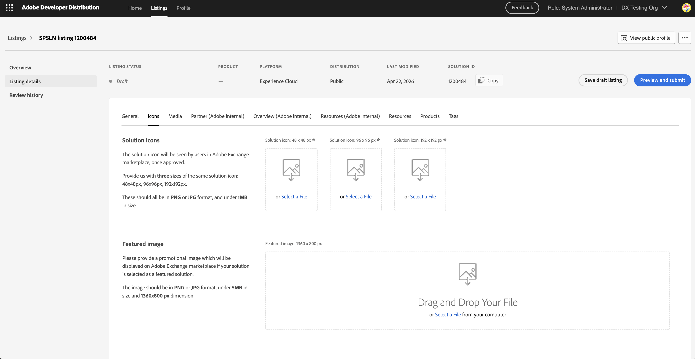

### Media

The Media tab allows partners to upload preview images and add preview video links that will be shown in the solution details page carousel on the marketplace.

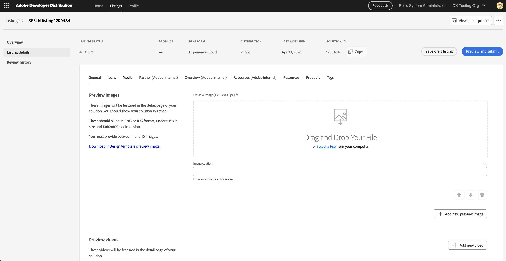

### Partner (Adobe internal)

The Partner tab collects contact information about the partner submitting the solution. This information is visible only to Adobe employees and will not appear on the public listing.

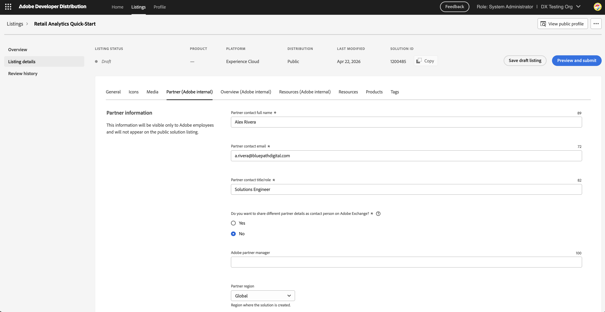

### Overview (Adobe internal)

The Overview tab contains business and market context that Adobe uses internally to evaluate and position the solution. For better readability, use dashed lists in description fields.

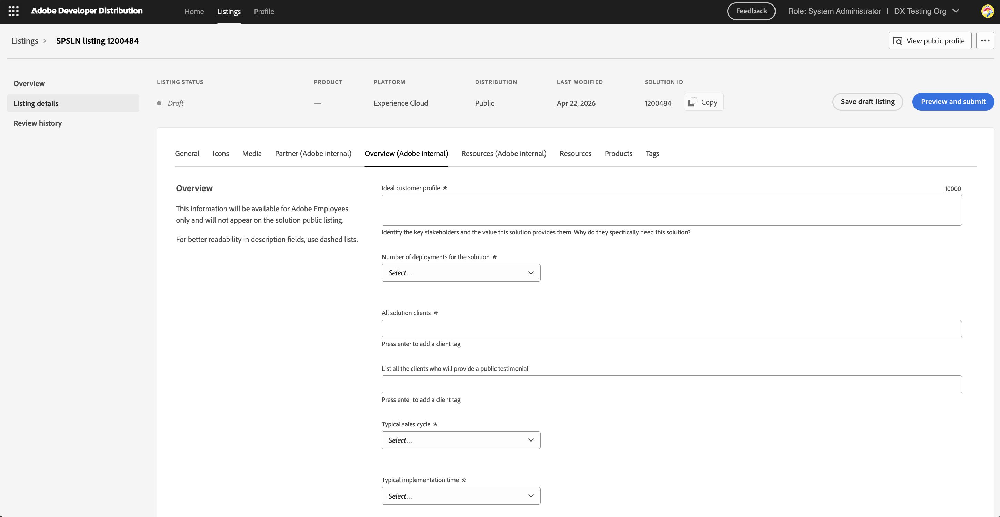

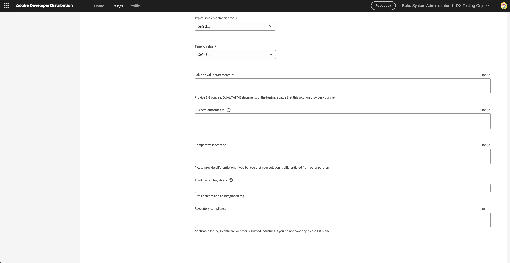

### Resources (Adobe internal)

The Resources (Adobe internal) tab allows partners to provide supporting documentation for Adobe reviewers. All documents can be submitted as a URL or PDF.

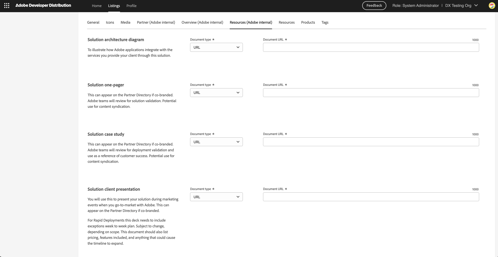

### Resources

The Resources tab allows partners to provide publicly visible supporting materials for the solution. These documents are accessible to customers on the Adobe Exchange Marketplace and the Adobe Partner Directory. All documents can be submitted as a URL or PDF.

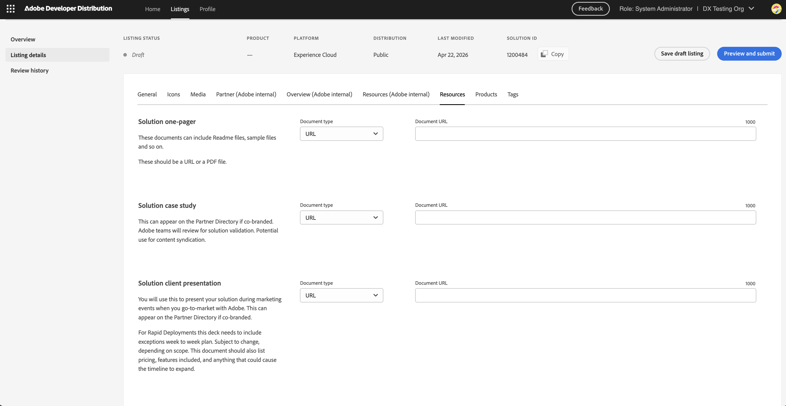

### Products

The Products tab is where partners select the Adobe applications that are used in this solution. Select all products that apply.

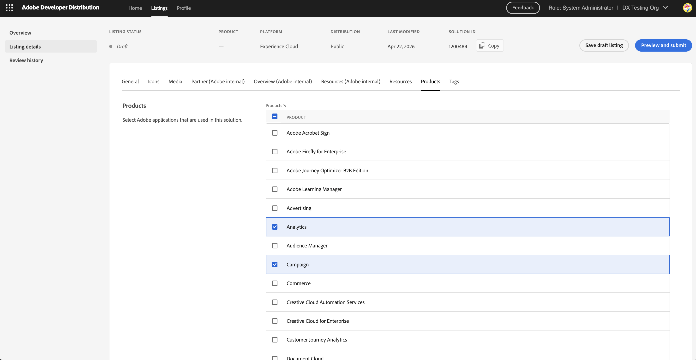

### Tags

The Tags tab contains industry and region information that is made public once the solution is approved. This information helps marketplace customers discover and filter solutions.

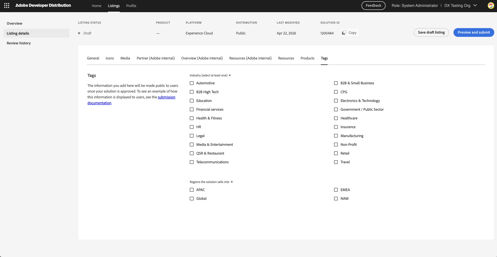

## Submitting for Review

When all mandatory fields have been completed, click the **Preview and submit** button to open the submission modal.

From the modal, partners can also preview how the solution will appear on the Exchange Marketplace, or view their public profile before submitting.

To enable the **Submit listing** button, partners must:

1. Provide a note to Adobe reviewers — Include any context needed to evaluate the submission, such as login information or testing instructions.
2. Confirm compliance with the [Adobe Brand Guidelines](https://partners.adobe.com/digitalexperience/preview/restricted/1/program-guide.pdf.html).
3. Agree to the **Adobe Accredited and Rapid Deployment Partner Solutions program terms**.

**Delay publishing** allows the partner to choose whether the solution should be published immediately upon Adobe approval, or held for manual publishing at a later date.

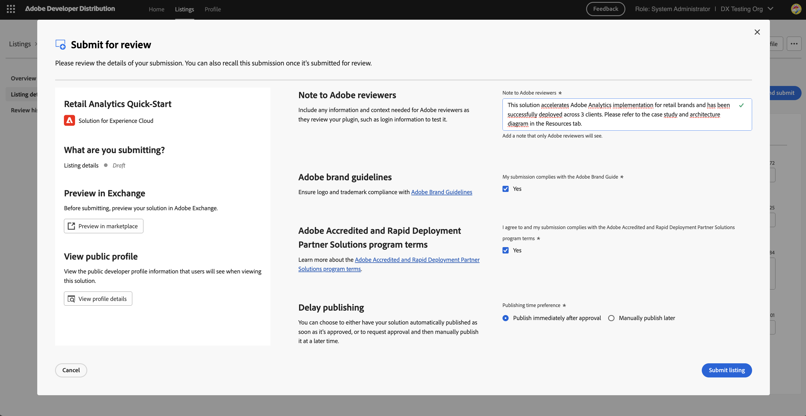

Upon successful submission, the partner is taken to the "Listing Overview" page where a confirmation message is displayed. The listing status changes from Draft to **In review**. A **Recall submission** button is available on this page, allowing the partner to withdraw the submission while it is still in queue before a reviewer is assigned.

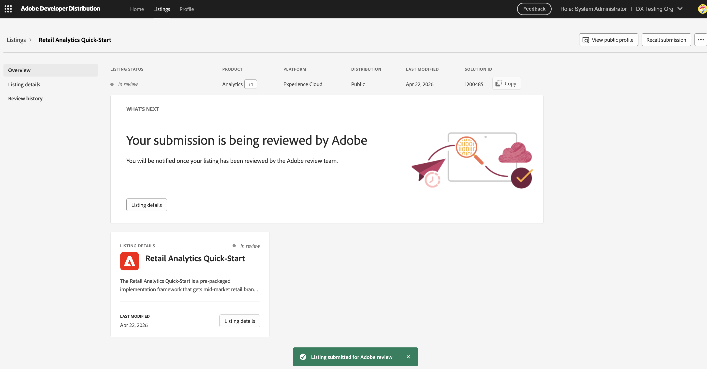

The partner will also receive an email confirmation from the Adobe Digital Experience Partner Program team, including the Solution ID, listing name, and a note that Adobe will provide a status update within 10 business days.

## Submission Review

When a solution has been submitted, an Adobe administrator will review the listing details. If all the information is complete and requirements are met, the reviewer will approve the submission. The listing status will update to **Published** if the partner chose immediate publishing, or **Approved** if delay publishing was selected.

The partner is notified by email when the listing is approved and published on the marketplace.

Once published, the Listing Overview page shows a **Published** status and a **Retract** button, which allows the partner to unpublish the solution if needed.

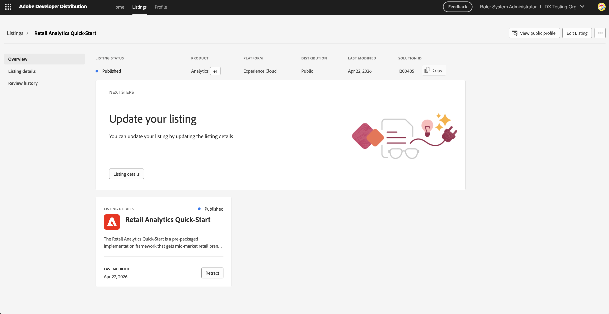

If the submission does not meet the requirements, the reviewer will reject it. The listing status changes to **Rejected** and the Listing Overview page displays a "Your submission needs additional review" banner with the reason for rejection.

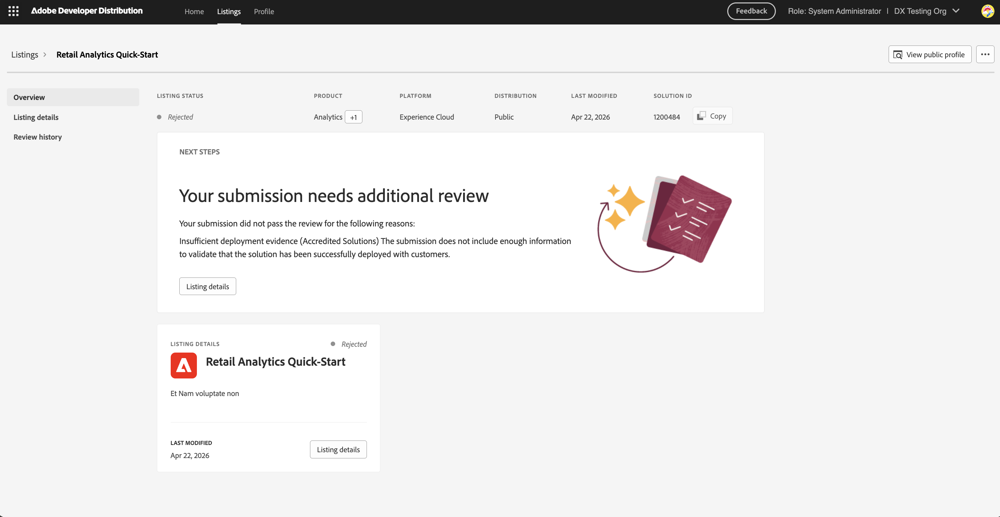

The partner will also receive an email from the Adobe Digital Experience Partner Program team with the rejection reason and next steps. Once the issues have been resolved, the listing can be resubmitted for review.

## Editing a Published Listing

Listing details can be edited on an approved, published, or retracted listing. To begin editing, click **Edit Listing** from the Listing Overview page. The listing status changes to **Published - editing** and edited fields are highlighted with a **Changed** indicator.

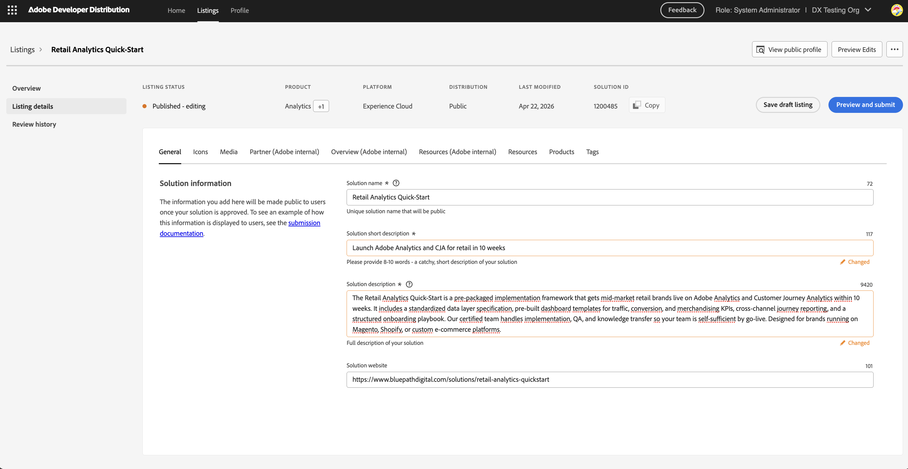

Edits can be submitted for review by clicking **Preview and submit**. The submission modal will show the listing status as **Published - editing** and display the changes being submitted. Note that **Delay publishing** is disabled for metadata changes to a published listing — updates take effect immediately upon approval.

If you have any questions, please submit a ticket to our [Partner Support Team](https://partners.adobe.com/digitalexperience/m/forms/case).
