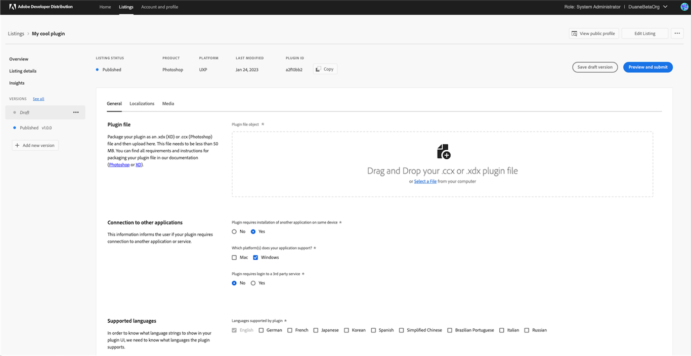
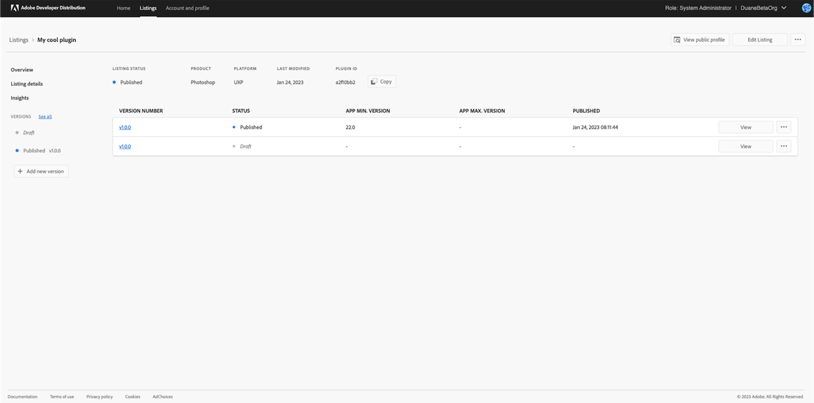
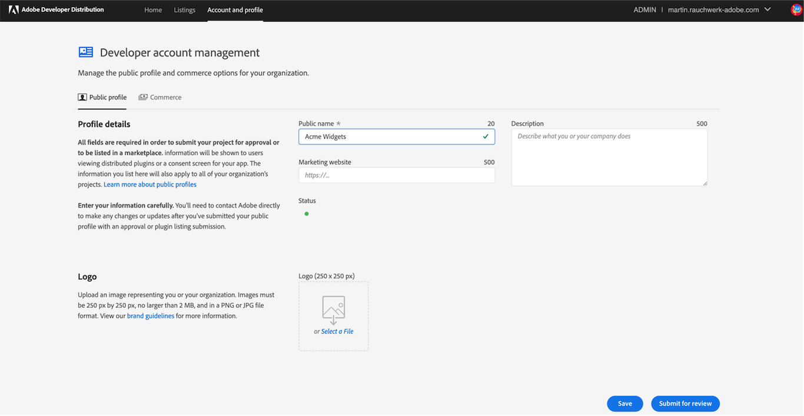

# Getting Started

This getting started guide introduces key areas of the [Adobe Developer Distribution portal](/distribute/home) to help you begin distributing your plugins quickly and easily. The Adobe Developer Distribution portal enables you to quickly publish a **listing** for your plugin on two Creative Cloud Marketplaces; the Creative Cloud desktop app Marketplace and Adobe Exchange in these three easy steps:

1. Add your public profile.
2. Create a **listing** to represent your plugin with metadata, the packaged plugin, and a **version**.
3. Submit your **listing** for approval to be published immediately or at a date you choose.

<InlineAlert slots="text" variant="help"/>

A **listing** is what users see on a Marketplace. It contains metadata to describe your plugin and how to use it, along with a specific **version** of your plugin to be installed by the Creative Cloud desktop app. For more details on these concepts and how they are used in the distribution of your plugin, see the [Glossary](./glossary.md).

## Overview

The following section will provide a brief overview of each view in the [Adobe Developer Distribution portal](/distribute/home) to help you get started using it quickly.

## Home

The home page is where developers create their public profile and create a new listing for their plugin. Here you will find "Quick start" links to create a new listing and edit or view your public profile. The "Get Started" box helps reminds developers that a profile must be created and submitted before any plugin can be submitted for approval.

As listings are created, up to three of the most recent will be shown for quick view and access. As listings are published, an "Insights" summary table will replace the "Get Started" box. To manage more than three listings, choose the **All listings** link or the **Listings** tab in the nav bar to go to the "Your Listings" page.

## Listings

Manage your listings either in card view or list view. Clicking **View** on any card leads to the Listing screen to update the listing details or plugin version. The ellipsis points to more options to manage listing lifecycle, such as publish an approved app or retract a published one. Note that until plugin icon is uploaded, a default product mneumonic logo will appear.

**Card View**

**List View**

## Listing

This view is shown when you click on a listing from either the "Home" tab or "Listings" tab and is where new or existing listings are managed. It also displays the overall listing and version status.

#### Overview - New Listing

Creating a listing lands you on the "Listing Overview" page. The "Get Started" helper text guides you to the new "Listing Details" or "Version" screens. Note that the first time alListing is published, both listing and version information must be complete before proceeding to submit.

#### Overview - Published Listing

Clicking the **View** button on any listing will navigate you to its "Listing Overview" screen. The "Next Steps" helper text guides developers to update the listing details or add a plugin version.

### Listing Details

This view allows you to manage your listing metadata in five tabs: General, Localizations, Media, Tags and Services.

#### Listing Details - New Listing

This is where you enter your new listing metadata. All mandatory fields are marked with an asterisk. “Add a version” helper text reminds developer that a version is also needed the first time a listing is published.

#### Listing Details - Published Listing

Clicking the upper right **Edit** button on a published, approved or retracted "Listing Details" page will enable editing of your metadata. Note the Published status has an – editing suffix and all edited fields are highlighted with a “Changed” box.

### Versions

This section of the listing details can be found in the left side nav and allows you to **Add** a new version or click on existing versions to manage them.

#### Version - Add New Version

This view allows you to add your specific version data, including your plugin package file in the "General" tab, your release notes in the "Localizations" tab and your screenshots/videos in the "Media" tab.

#### Version - Manage Existing Version

The main thing to note that is different from the above, is that no data can be changed for a "Submitted" or "Published" version, but the plugin can be downloaded.

#### Version - Manage All Versions

Here you are shown your list of versions so you can easily retract published ones, re-publish retracted ones or delete rejected or draft versions.

### Insights

View the number of plugins acquired by month and year, multiple version status summary and review or manage Ratings & Reviews.

## Account and Profile Page

Manage/submit your public facing publisher profile information and enter a [FastSpring](https://fastspring.com/sign-up/payee-adobe/) Key in the "Commerce" tab for paid listings.

<InlineAlert slots="text" variant="warning"/>

The public profile _must_ be submitted before, or simultaneously with your first listing submission.

<!-- 1. Create and submit a public profile
2. Create your listing and enter the associated metadata
3. Upload a packaged plugin version
4. Submit your listing (with the option to preview it first, and the choice to publish it immediately or later) -->
